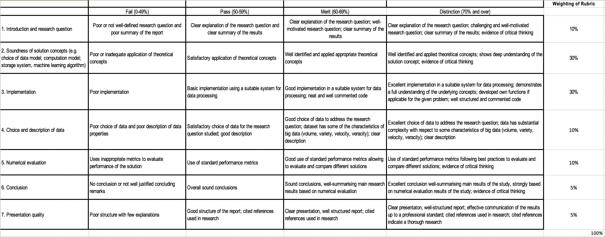

# Analysis of Networks

Candidate number: 34445

## Abstract

#### What is the problem?

In this project I consider a problem of analysing network graphs from big dynamic data sources such as Twitter stream that generates on average 500M tweets a day. Even if one wants to analyse tweets associated with a single hashtag or keyword, one needs to deal with the issue of big data.   

#### Why is it a problem?

Due to the real time nature of the data, one cannot predict how much information will become available and need to be included in the analysis. Furthermore, the dataset is typically very large and requires use of computing clusters to process data in a reasonable time. Some analyses, like on network graphs, are difficult to parallelize. Finally, complex multi-dimensional data, such as large network graphs, cannot be easily presented in a (visual) form that users can reason about. 

#### What is the solution 
In my project, I completed the full end-to-end process that covers three main aspects: (1) data collection and pre-processing through streaming of Twitter data (with Kafka) related to specific keywords, (2) parallelization of data processing for analysis of a large network graph and content of 1.6M tweets (using LDA topic modelling) and (3) multi-dimensional data visualization by embedding of the graph data (using node2vec) with the aim to maximize the likelihood of preserving the neighbourhood and used t-SNE embedding to enable two-dimensional visualization of data by minimizing the KL diversion between the joint probabilities of the 2-D output of the word2vec output. 

## Project Outline

In this project I investigate and evaluate methods that could be incorporated in a system for processing big dynamic data such as Twitter social media data. Challenges include implementing methods for efficient collection of data from the Twitter stream and processing them in real time to convert or extract relevant data for further analysis. 

Furthermore, analysis of big data that involves links among data records, such as analysis of a network graph of individuals involved in retweeting and mentioning on Twitter, requires distributing the data, processing, and graph storage across multiple machines. Thus, data processing methods and algorithms need to be optimized for distributed processing across a cluster of machines. 

Finally, outputs of big data processing may involve high-dimensional data, such as network graph, that need to be transformed in order to visualize and further analyse. 

## Methods

### Kafka and Spark Streaming

In my work I explore these three big data issues by considering how topical tweets that are related to the current covid-19 pandemic can be downloaded and then transformed into a network graph for social network analysis. I used Kafka publish- subscribe messaging system to collect 1.6M of tweets from Twitter over a period of 24 hours using. It is assumed that tweets can be continuously streamed and that the extracted social graph can be periodically updated, e.g., on a daily basis. Data streaming and pre-Processing are documentated in a tutorial:

- [Spark Streaming](streaming/Streaming.md)

which uses python scripts:

- [kafka_twitter_producer.py](streaming/kafka_twitter_producer.py)
- [tweet_collector.py](streaming/tweet_collector.py)

### Twitter Network Graph and Content Analysis and Visualisations Using Spark

I used Apache Spark, a cluster computing framework, and PySpark, the Python programming interface for Spark, to implement distributed storage of the network graph and enable parallelization of algorithms for (1) social graph analysis (ego-centric networks and network clusters) and (2) topic modelling with Latent Dirichlet Allocation (LDA). 

Then, I implemented node2vec embedding using the random walk and word2vec algorithm in order to learn a multi-dimensional  vector mapping of users. Node2vec was selected in order to maximize the likelihood of preserving the neighbourhood network of nodes. The neighbourhood is defined, i.e., estimated based on the first-order Markov random walk applied to each node for a pre-defined number of steps.  

Subsequently I applied t-SNE embedding in order to enable two-dimensional data by converting similarity between data points to joint probabilities and minimizing the KL diversion between the joint probabilities of the resulting 2 dimensional and their original output of the word2vec. I used MatPlotLib and Seaborn packages to visualize the graphs. 

The resulting visualization shows the clusters of twitter users. We integrate LDA topics information by assigning to each user node the most prominent topic. This representation of twitter activities on the Covid19 topic can be used in further analysis to identify patterns in topic distributions. 

Implementation and experiments are documented in two notebooks:
- [Graph Analysis Notebook](notebooks/Graph_Analysis.ipynb) - graph analysis of collected Twitter data and visualisation of graph embeddings.
- [Topic Modelling Notebook](notebooks/Topic_Modelling.ipynb) - topic analysis of Twitter data content and further visualisation of graph embeddings.

With supplementary files:
- [`tweet_collector.py`](streaming/tweet_collector.py): import of the `get_tweet_rows` function in Graph Analysis Notebook.
- [`my-actions.sh`](supplementary/my-actions.sh): actions for initialisation of clusters in Topic Analysis Notebook.
- [`twitter_languages.json`](supplementary/twitter_languages.json): language code dictionary for Graph Analysis Notebook.
- [`embedding_functions.py`](supplementary/embedding_functions.py): embedding functions used in both notebooks.

## Conclusion

In this project, I completed an end-to-end process from collecting dynamic data to analysis of large network graph to visualization of the network properties. I set up infrastructure components and implemented algorithms that illustrate how an operational system for big dynamic data could be designed and applied. Based on my implementation and experiments, I can report on the different components of the system:

#### Data collection component: 

Management of data streaming, using Kafka and Spark streaming, supports collection and real time pre-processing of data at scale (1.6M tweets in 24 hours). Real-time pre-processing involved transformation of JSON tweet objects into TSV text files. 

#### Data analysis component:  

Processing of large network graph (1.1M node and 1.6 edges) was successfully completed using Google DataProc clusters using multiple worker nodes (Spark) and enabled calculation of graph statistics. More precisely, using RDD and Spark graphframes, I analysed node neighbourhoods of 1-hop, 2-hops with triangles and calculated clustering coefficients and page-ranks. 

In addition to the graph analysis, Spark framework enabled efficient analysis of tweets content, including the natural language processing of text and extraction of metadata such the language of the tweets. 

For English and Spanish, I applied distributed LDA algorithm (PySpark MLLib) to model 10 and 20  in the tweets. 
Both graph and content analysis were merged in the final stage to illustrate the topic interest of individuals in cluster of tweeter users that were obtained through node2vec analysis. 

Spark operations on RDD and the word2vec algorithm were efficiently applied to provide a graph embedding that can be used for further processing, e.g., 2D mapping of the network graph.  

#### Data visualization component: 

After running the node2vec algorihtm, visualization does not require parallelization and was effectively executed using visualization packages (MatPlotLib and SeaBorn) run within the same cluster environment. The t-SNE embedding enabled visualization of the node2vec graph embeddings by preserving neighbourhood cluster. This enabled us to see how user characteristics are expressed across clusters, such as language use and topic interests. 

#### Final remarks
Overall the system successfully covered all the stages. For future work, I would plan to collect data over a large period of time, in order to capture how topics and community interest change over time. 

-----------------------------------------------------------------------------------------------------------------------------

-----------------------------------------------------------------------------------------------------------------------------

## PROJECT:  Analysis of Network Graphs 
 
## PROBLEM: 
Social media data has inherent network graph structure that can reveal patterns in the social interactions. The scale of social interactions, like Tweeter communication, represents a challenge to the storing and systematic processing of large network structures. In order to apply distributed processing techniques, one needs to partition the data and then apply distributed algorithms, without losing elements of the network structure or accuracy of the graph statistics. At the same time, not all the algorithms can be mapped onto models that are ideal for distributed data processing, e.g. MapReduce. 
 
## OBJECTIVES: 
Our aim is to explore the feasibility of importing large Twitter data and extracting graph metadata in real time to create a network graph. The resulting graph would then be processed to compute statistics related to one-hop and two-hop ego-centric networks for individual nodes. Such statistics will be analysed to understand different types of connectivity within the one-hop of each node in the graph. The final report would include the distribution analysis of ego-centric networks based on the node degrees and triangles that represent connectivity in the community of immediate neighbours. 
 
## SYSTEM ARCHITECTURE:
The system consists of two distributed data processing components: 
1.	Streaming of data component:  Import of Twitter and processing of tweets to identify retweet and reply references. The result is a list of nodes and edges that comprise the social network graph.
a.	Twitter API, Kafka and Spark Streaming to import and extract tweets in real-time
b.	Python Scripts for pattern matching to identify standard Twitter references to authors, retweets, mentions
c.	PySpark transformations to create nodes and edges. Incoming nodes are appended and saved/merged to create the set of vertices and edges in the form of RDDs.
2.	Distributed processing of the social network graph using Spark graph data structure, GraphFrame to be further processed for network metrics. 
a.	Transform RDDs into the GraphFrame
b.	Application of analysis methods
 
## ANALYSIS METHODS
-	In-degree, out-degree for nodes; weights for edges, for multiple/cumulative number of occurrences of communication among same nodes. 
-	Using motif queries, identify one-hop and two-hop neighbourhoods for all nodes and calculate number of triangles per node and degree of two-hop reach. This provides insight into each node’s connectivity of one-hop neighbourhood and reach through its neighbour. 
-	Exploration of further network metrics and their possible calculation/approximation using motifs/MapReduce transformations
 
## REPORT STRUCTURE
-	Introduction, problem statement, related work, architecture, algorithms, experiment results, conclusions and references. 
 
## REFERENCES
-	references related to: streaming, network graph analysis and metrics, distributed graph metrics algorithms, feasibility and performance of Spark, etc., graph pattern analyses in literature (e.g., motifs of one-hop neighbourhood) 

## NOTES

* [MV 27 April 2020] Approved.

* [MV 25 April 2020] Some suggestions:

Graph streaming algorithms – one line of research work that may be of interest are streaming graph algorithms. This was considered for computing various graph properties under various assumptions how the graph is presented – e.g. allowing only for vertex / edge additions, or also allowing for deletions. Relevant keywords include “graph streaming algorithms” and “dynamic graphs”. Here is a survey https://people.cs.umass.edu/~mcgregor/papers/13-graphsurvey.pdf, and here is a tutorial https://people.cs.umass.edu/~mcgregor/graphs/, and here is a sample paper on triangle counting on graph streams https://www.vldb.org/pvldb/vol6/p1870-aduri.pdf
 
Network centrality measures – perhaps interesting to consider network centrality measures beyond simple local measures such as in-degrees and out-degrees, e.g. Eigencentrality, betweenness, HITS, Katz centrality, closeness, some listed here https://www.cl.cam.ac.uk/teaching/1213/L109/stna-lecture3.pdf; it may be interesting to implement and evaluate a distributed algorithm for a network centrality measure; here is one paper I stumbled upon https://arxiv.org/pdf/2001.08108.pdf

---
## Marking criteria

## Candidate topics
[Project.md](https://github.com/lse-st446/lectures2020/blob/master/Projects.md)
